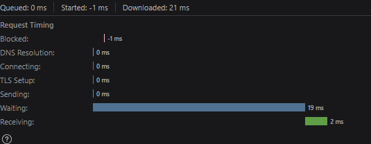
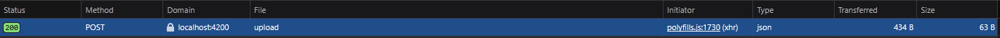
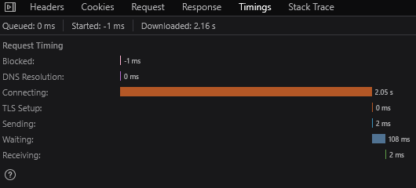
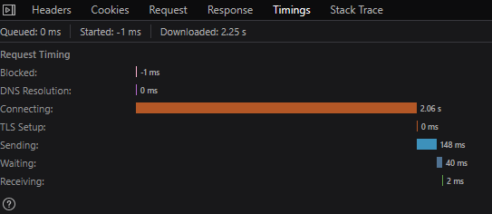
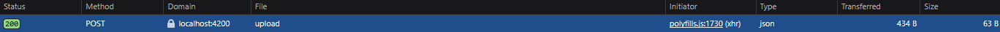

# PERF

Certaines fonctionnalités diffèrent grandement dans leur temps d'exécution en fonction de ce que l'utilisateur fait (ex : téléchargement et téléversement). Pour assurer que notre application répond à nos besoins de manière efficace, des critères d'acceptation des performances ont été établis :

### Téléversement

* Cas 1 : Fichiers de moins de 1 Ko : <= 100 ms

* Cas 2 : Fichiers de moins de 1 Mo : <= 3000 ms

* Cas 3 : Fichiers de moins de 20 Mo : <= 5000 ms

